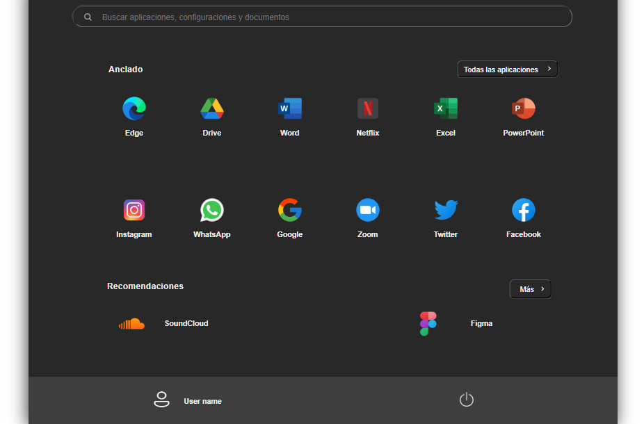

# Replicación del Sidebar de Windows 11

Este ejercicio práctico tiene como objetivo replicar la apariencia del Sidebar de Windows 11 utilizando únicamente HTML y CSS. En este caso, no se ha utilizado HTML semántico, ya que el enfoque principal fue explorar las capacidades de CSS Grid para lograr una similitud lo más cercana posible a la imagen de referencia.

## Detalles del Proyecto

El proyecto se centra en replicar el Sidebar de Windows 11, haciendo uso extensivo de las propiedades de CSS Grid.

## Tecnologías Utilizadas

- HTML
- CSS

## Próximos Pasos

El siguiente paso sera incluir diseño responsivo.

## Vista Previa del Proyecto

Replica

¡Gracias por revisar este proyecto!.
